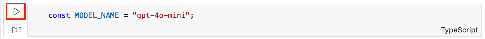

<div align="center">


# GitHub Models JavaScript Playground

[](https://codespaces.new/Azure-Samples/github-models-javascript-playground?hide_repo_select=true&ref=main&quickstart=true)


[](LICENSE)

⭐ If you like this repo, star it on GitHub — it helps a lot!

[Overview](#overview) • [Usage](#usage) • [Run the samples](#run-the-samples) • [Next steps](#next-steps) • [Resources](#resources)

</div>

## Overview

Try out generative AI models right in your browser for free using this playground! ✨

Using [GitHub Codespaces](https://github.com/features/codespaces) and [GitHub Models](https://github.com/marketplace/models), you'll be able to run LLMs (*Large Language Models)* such as [Open AI GPT-4o](https://github.com/marketplace/models/azure-openai/gpt-4o) directly in your browser, without having to install anything.
 
## Usage

This project is designed to be opened in GitHub Codespaces, which provides you a pre-configured environment to run the code and AI models. Follow these steps to get started:

1. Click on the "Codespaces: Open" button:<br>[](https://codespaces.new/Azure-Samples/github-models-javascript-playground?hide_repo_select=true&ref=main&quickstart=true)
2. Once the Codespace is loaded, it should have everything pre-installed, including the [OpenAI Node SDK](https://github.com/openai/openai-node).
3. Open the file `notebook.ipynb` in the editor and follow the instructions.

> [!TIP]
> While you're following the instructions of the interactive notebook, you can run the code cells by clicking on the "Execute cell" (▶️) button in the top left corner of the cell. You can also edit the code and run it again to see how the model responds to different inputs.
> 

## Run the samples

In the [samples](./samples) folder of this repository, you'll find examples of how to use generative AI models using the OpenAI Node.js SDK. You can run them by executing the following command in the terminal:

```bash
tsx samples/<filename>
```

Alternatively, you can open a sample file in the editor and run it directly by clicking the "Run" (▶️) button in the top right corner of the editor.

## Next steps

Once you're comfortable with this playground, you can explore more advanced topics and tutorials:
- [Generative AI for beginners](https://github.com/microsoft/generative-ai-for-beginners) [course]: a complete guide to learn about generative AI concepts and usage.
- [Phi-3 Cookbook](https://github.com/microsoft/Phi-3CookBook) [tutorials, samples]: hands-on examples for working with the Phi-3 model.

When you're ready to explore how you can deploy generative using Azure, you should check out these resources:
- [Quickstart: Get started using GPT-35-Turbo and GPT-4 with Azure OpenAI Service](https://learn.microsoft.com/azure/ai-services/openai/chatgpt-quickstart?tabs=command-line%2Cpython-new&pivots=programming-language-javascript) [tutorial]: a tutorial to get started with Azure OpenAI Service.
- [Build a serverless AI chat with RAG using LangChain.js](https://techcommunity.microsoft.com/t5/apps-on-azure-blog/build-a-serverless-ai-chat-with-rag-using-langchain-js/ba-p/4111041) [sample]: a next step tutorial to build an AI chatbot using Retrieval-Augmented Generation and LangChain.js.

## Resources

Here are some additional resources to help you learn more about generative AI:
- [Awesome Generative AI](https://github.com/steven2358/awesome-generative-ai) [links]: a curated list of resources about generative AI.
- [Fundamentals of Responsible Generative AI](https://learn.microsoft.com/training/modules/responsible-generative-ai/) [course]: a training module to learn about the responsible use of generative AI.
- [Azure AI Studio](https://ai.azure.com/) [tool]: a web portal to create, train, deploy and experiment with AI models.

### Other playgrounds
- [Ollama JavaScript Playground](https://github.com/Azure-Samples/ollama-javascript-playground/)
